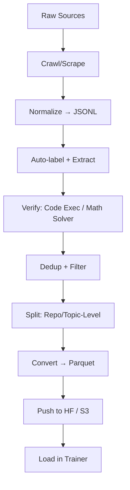

---

## 1. **Best Storage Format: Parquet (Primary) + JSONL (Secondary)**

| Format | Use Case | Pros | Cons |
|-------|--------|------|------|
| **Parquet** | **Primary storage & training** | Columnar, compressed, fast reads, schema-enforced, Spark/HF/Pandas native | Binary (not human-readable) |
| **JSONL** | **Debugging, inspection, LLM prompting** | Human-readable, line-by-line, easy to filter/grep | Larger, slower, no schema |
| **CSV** | Legacy / quick sharing | Universal | No nesting, slow, no compression |
| **SQLite** | Small datasets (<1M rows) | Queryable, portable | Not scalable |

> **Winner: Store in Parquet, keep JSONL for inspection.**

```bash
# Example: Convert JSONL → Parquet
import pandas as pd
df = pd.read_json("math_problems.jsonl", lines=True)
df.to_parquet("math_problems.parquet", compression="zstd")
```

---

## 2. **Dataset Structure & Schema (Code & Math)**

### A. **Code Dataset Schema (Parquet columns)**

| Column | Type | Description |
|-------|------|-------------|
| `id` | string | Unique ID (e.g., `github-py-uuid`) |
| `repo` | string | Source repo (for train/test split) |
| `path` | string | File path |
| `language` | string | `python`, `java`, etc. |
| `code` | string | Raw code snippet |
| `docstring` | string | Function/class doc (if any) |
| `tests` | list[string] | Unit tests (JSON-encoded) |
| `signature` | string | Function signature |
| `complexity` | float | Cyclomatic complexity (optional) |
| `license` | string | SPDX identifier |
| `split` | string | `train` / `val` / `test` |

> **Pro tip**: Store `tests` as JSON string in column → parse on-the-fly.

### B. **Math Dataset Schema**

| Column | Type | Description |
|-------|------|-------------|
| `id` | string | `aime-2020-q12` |
| `source` | string | `AIME`, `AMC`, `synthetic` |
| `difficulty` | int | 1–10 |
| `problem` | string | Full text |
| `solution` | string | Final answer (e.g., `42`) |
| `cot` | string | Chain-of-thought (step-by-step) |
| `concepts` | list[string] | `["algebra", "geometry"]` |
| `latex` | string | Full LaTeX rendering |
| `verified` | bool | Passed solver check |
| `split` | string | `train`/`val`/`test` |

---

## 3. **Labeling Strategy: Auto + Verified + Iterative**

| Step | Method | Tools |
|------|-------|-------|
| **1. Auto-label** | Heuristics + LLMs | `pylint`, `docstring-parser`, `gpt-4-turbo` |
| **2. Verify** | Execution / Solvers | `pytest`, `SymPy`, `Z3`, `Lean` |
| **3. Clean** | Dedup + filter | `minhash`, `exact dedup` |
| **4. Augment** | CoT, tests, rephrasing | `DSPy`, `LangChain`, `vLLM` |

### Example: Auto-label Code
```python
import ast

def extract_functions(code):
    tree = ast.parse(code)
    return [node.name for node in ast.walk(tree) if isinstance(node, ast.FunctionDef)]
```

### Example: Verify Math
```python
from sympy import solve, symbols
x = symbols('x')
eq = "x**2 - 5*x + 6"
assert solve(eq) == [2, 3]  # Auto-verify
```

---

## 4. **Tools Stack (End-to-End Pipeline)**

| Task | Tool | Why |
|------|------|-----|
| **Crawling** | `GitHub API`, `BigQuery Public Datasets` | Free, legal, diverse |
| **Scraping** | `BeautifulSoup`, `Playwright` | For math forums, PDFs |
| **Processing** | `Apache Spark`, `Polars`, `Dask` | 100M+ rows |
| **Storage** | `Parquet` + `S3` / `GCS` | Cheap, scalable |
| **Versioning** | `DVC`, `LakeFS`, `Delta Lake` | Reproducible |
| **Labeling** | `Label Studio`, `Prodigy`, `Snorkel` | Hybrid auto+human |
| **Verification** | `Code Executers`, `Lean`, `Isabelle` | Zero hallucination |
| **Training Prep** | `Hugging Face Datasets`, `TensorFlow Datasets` | Seamless loading |
| **Monitoring** | `Weights & Biases`, `Comet` | Track data drift |

---

## 5. **Preparation Pipeline (Step-by-Step)**



### Example: `prepare_code.py`
```python
import datasets
from datasets import load_dataset

ds = load_dataset("json", data_files="raw_code.jsonl")
ds = ds.map(extract_tests, batched=True)
ds = ds.filter(lambda x: x["tests"] is not None)
ds = ds.train_test_split(test_size=0.1, seed=42, stratify_by_column="repo")
ds.save_to_disk("processed/code_hf")
```

---

## 6. **Best Practices Summary**

| Do | Don’t |
|------|---------|
| Use **Parquet** for training | Use **CSV** at scale |
| Split by **repo/problem set** | Random split (leakage!) |
| Store **tests/solutions** | Train on code without validation |
| Verify **every sample** | Trust LLM output blindly |
| Version **data + code** | Re-run without reproducibility |

---

## Recommended Starter Kits

| Domain | Repo |
|-------|------|
| Code | [princeton-nlp/SWE-bench](https://github.com/princeton-nlp/SWE-bench) |
| Math | [hendrycks/math](https://github.com/hendrycks/math) |
| Pipeline | [Hugging Face `datasets` CLI](https://huggingface.co/docs/datasets/) |
| Synth | [microsoft/ProphetNet](https://github.com/microsoft/ProphetNet) (math synth ideas) |

---

## Final Recommendation

> **Store in `Parquet` → Label with auto + verification → Prepare with `datasets` library → Train with confidence.**

Start small:
```bash
# 1. Generate 1K math problems
python generate_math.py --output data/raw.jsonl

# 2. Verify + clean
python verify.py data/raw.jsonl data/clean.parquet

# 3. Push
datasets-cli upload data/clean.parquet myusername/math-verified
```

Want a **template repo**? I can generate one for you (code + math). Just say the word.

Here's a comprehensive guide to convert PDFs into datasets for Hugging Face or Kaggle:

## 1. **PDF Text Extraction Tools**

### Python Libraries:
```python
# PyPDF2 (for basic text extraction)
import PyPDF2
with open('file.pdf', 'rb') as file:
    reader = PyPDF2.PdfReader(file)
    text = ""
    for page in reader.pages:
        text += page.extract_text()

# pdfplumber (more accurate)
import pdfplumber
with pdfplumber.open('file.pdf') as pdf:
    text = ""
    for page in pdf.pages:
        text += page.extract_text()

# PyMuPDF (fast and reliable)
import fitz
doc = fitz.open('file.pdf')
text = ""
for page in doc:
    text += page.get_text()
```

### OCR for Scanned PDFs:
```python
# pytesseract + pdf2image
from pdf2image import convert_from_path
import pytesseract

images = convert_from_path('scanned.pdf')
text = ""
for image in images:
    text += pytesseract.image_to_string(image)
```

## 2. **Structuring Your Data**

### Basic CSV Structure:
```python
import pandas as pd
import json

# For document Q&A datasets
data = {
    "id": [],
    "text": [],
    "source": [],
    "page_number": [],
    "metadata": []
}

# Fill your data
pdf_texts = extract_pdf_texts("your_pdf.pdf")
for i, text in enumerate(pdf_texts):
    data["id"].append(i)
    data["text"].append(text)
    data["source"].append("your_pdf.pdf")
    data["page_number"].append(i+1)
    data["metadata"].append(json.dumps({"extraction_method": "pdfplumber"}))

df = pd.DataFrame(data)
df.to_csv("pdf_dataset.csv", index=False)
```

## 3. **Advanced Processing Pipelines**

### For Multiple PDFs:
```python
import os
import pandas as pd
from pathlib import Path

def process_pdf_folder(pdf_folder):
    dataset = []
    
    for pdf_file in Path(pdf_folder).glob("*.pdf"):
        try:
            with pdfplumber.open(pdf_file) as pdf:
                for page_num, page in enumerate(pdf.pages):
                    text = page.extract_text()
                    if text.strip():  # Only add non-empty pages
                        dataset.append({
                            "doc_id": f"{pdf_file.stem}_{page_num}",
                            "text": text.strip(),
                            "source_file": pdf_file.name,
                            "page_number": page_num + 1,
                            "total_pages": len(pdf.pages)
                        })
        except Exception as e:
            print(f"Error processing {pdf_file}: {e}")
    
    return pd.DataFrame(dataset)

# Process all PDFs in a folder
df = process_pdf_folder("./pdfs/")
```

## 4. **Dataset Formats for Platforms**

### For Hugging Face:
```python
from datasets import Dataset

# Convert pandas DataFrame to Hugging Face dataset
hf_dataset = Dataset.from_pandas(df)

# Push to Hugging Face Hub
hf_dataset.push_to_hub("your-username/your-dataset-name")

# Or save locally
hf_dataset.save_to_disk("./pdf_dataset")
```

### For Kaggle:
```python
# Save in Kaggle-friendly format
df.to_csv("pdf_dataset.csv", index=False)

# For larger datasets, use parquet
df.to_parquet("pdf_dataset.parquet", index=False)

# Create dataset metadata for Kaggle
metadata = {
    "title": "PDF Text Extraction Dataset",
    "id": "your-username/pdf-text-dataset",
    "licenses": [{"name": "CC0-1.0"}]
}

with open("dataset-metadata.json", "w") as f:
    json.dump(metadata, f)
```

## 5. **Specialized Processing**

### For Academic Papers:
```python
def extract_academic_paper(pdf_path):
    """Extract structured information from academic papers"""
    with pdfplumber.open(pdf_path) as pdf:
        # Extract first page for title/abstract
        first_page = pdf.pages[0]
        text = first_page.extract_text()
        
        # Simple title extraction (first line)
        lines = text.split('\n')
        title = lines[0] if lines else ""
        
        return {
            "title": title,
            "full_text": text,
            "abstract": extract_abstract(text),
            "sections": extract_sections(text)
        }
```

### For Tabular Data in PDFs:
```python
def extract_tables_from_pdf(pdf_path):
    """Extract tables from PDF pages"""
    tables_data = []
    
    with pdfplumber.open(pdf_path) as pdf:
        for page_num, page in enumerate(pdf.pages):
            tables = page.extract_tables()
            for table_num, table in enumerate(tables):
                if table:  # If table exists
                    tables_data.append({
                        "page": page_num + 1,
                        "table_num": table_num + 1,
                        "data": table,
                        "headers": table[0] if table else []
                    })
    
    return tables_data
```

## 6. **Quality Control & Cleaning**

```python
def clean_text(text):
    """Clean extracted text"""
    import re
    
    # Remove excessive whitespace
    text = re.sub(r'\s+', ' ', text)
    
    # Remove page headers/footers (customize based on your PDFs)
    text = re.sub(r'Page \d+ of \d+', '', text)
    
    # Fix common OCR errors
    corrections = {
        'rn': 'm',
        '|': 'l',
        # Add more based on your data
    }
    
    for wrong, correct in corrections.items():
        text = text.replace(wrong, correct)
    
    return text.strip()

# Apply cleaning to your dataset
df['cleaned_text'] = df['text'].apply(clean_text)
```

## 7. **Complete Pipeline Example**

```python
def create_pdf_dataset(pdf_directory, output_name):
    """Complete pipeline from PDFs to dataset"""
    
    # 1. Extract text from all PDFs
    all_data = []
    for pdf_file in Path(pdf_directory).glob("*.pdf"):
        pdf_data = process_single_pdf(pdf_file)
        all_data.extend(pdf_data)
    
    # 2. Create DataFrame
    df = pd.DataFrame(all_data)
    
    # 3. Clean data
    df['cleaned_text'] = df['text'].apply(clean_text)
    
    # 4. Save for both platforms
    # For Hugging Face
    hf_dataset = Dataset.from_pandas(df)
    hf_dataset.push_to_hub(f"your-username/{output_name}")
    
    # For Kaggle
    df.to_csv(f"{output_name}.csv", index=False)
    
    print(f"Dataset created with {len(df)} entries")
    return df
```

## 8. **Best Practices**

- **Validate extraction quality** manually on sample pages
- **Include metadata** about source files and extraction methods
- **Handle different PDF types** (text-based vs scanned) appropriately
- **Consider chunking** large documents for NLP tasks
- **Add data licenses** and attribution information

## 9. **Useful Tools & Services**

- **Adobe Extract API** - For high-quality commercial extraction
- **Amazon Textract** - Good for forms and tables
- **Google Document AI** - Advanced document processing
- **Open-source alternatives**: pdfminer, slate3k

This approach will give you clean, structured datasets ready for either Hugging Face or Kaggle platforms.
